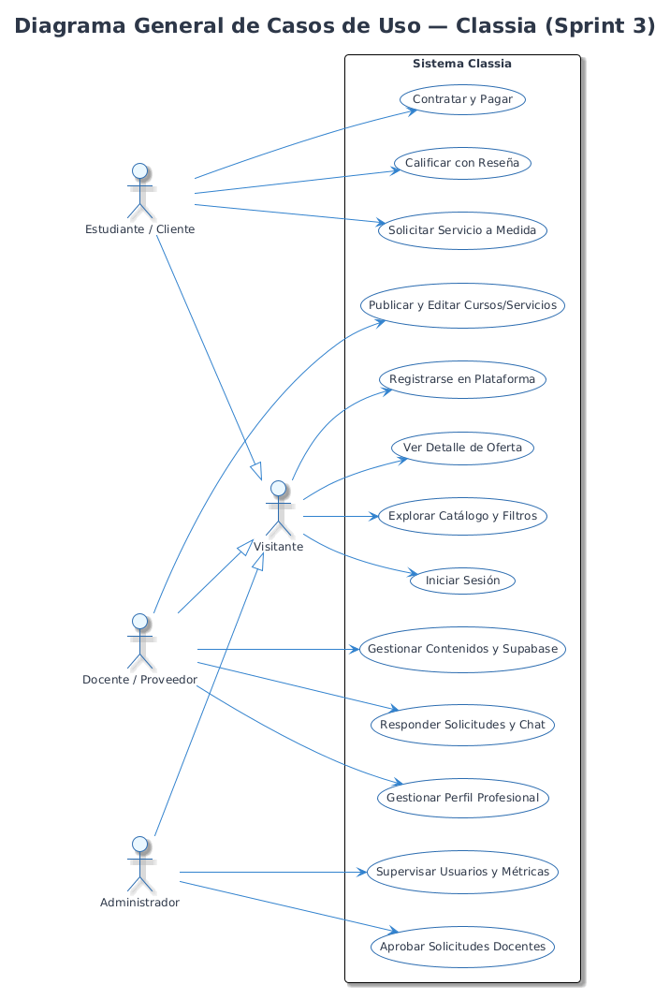
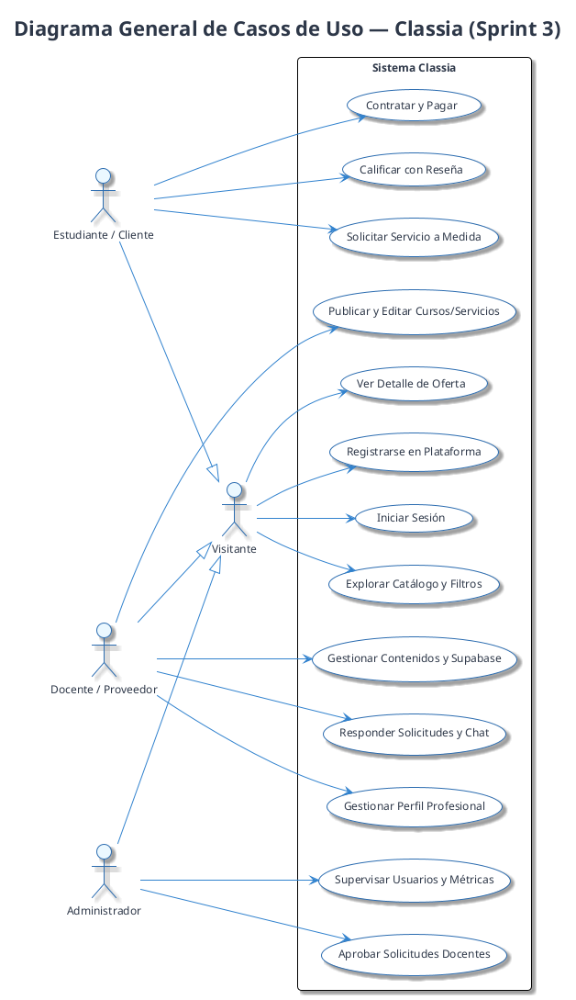
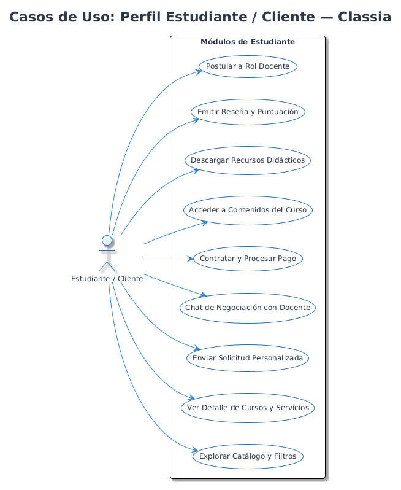
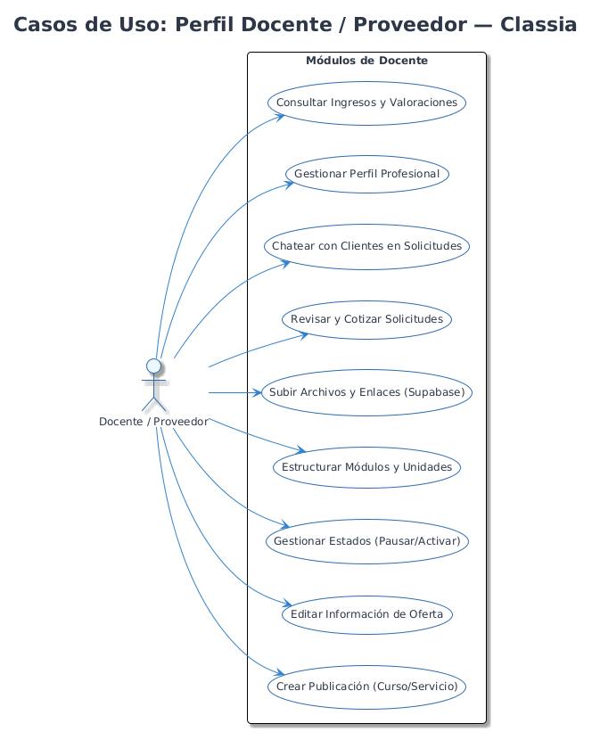
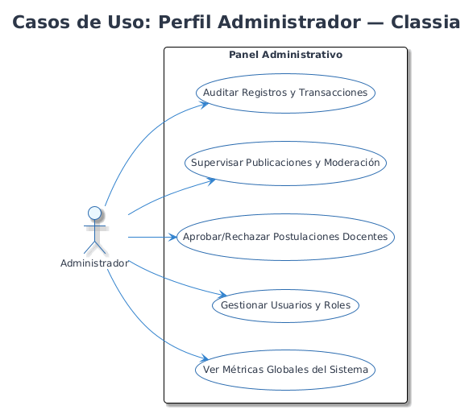

# Diagramas de Casos de Uso — Classia · Segunda Entrega (Sprint 3)

## 1. Diagrama General del Sistema

*Versión vectorial:* [casos_de_uso_general.svg](diagramas/casos_de_uso_general.svg) | *Código fuente:* [casos_de_uso_general.puml](diagramas/casos_de_uso_general.puml)

---

## 2. Casos de Uso por Rol

### A. Perfil Estudiante / Cliente

*Versión vectorial:* [casos_de_uso_estudiante.svg](diagramas/casos_de_uso_estudiante.svg)

### B. Perfil Docente / Proveedor

*Versión vectorial:* [casos_de_uso_docente.svg](diagramas/casos_de_uso_docente.svg)

### C. Perfil Administrador

*Versión vectorial:* [casos_de_uso_admin.svg](diagramas/casos_de_uso_admin.svg)
