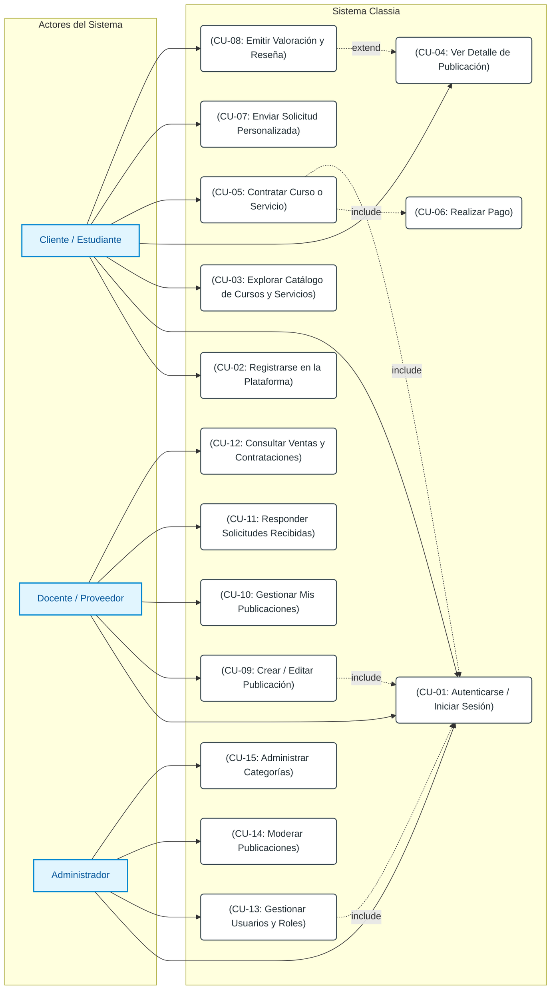

# Diagrama de Casos de Uso General - Classia

## Resumen del Documento
Este documento especifica el **Diagrama de Casos de Uso General** para la plataforma **Classia**, representando de forma formal y visual cómo interactúan los distintos actores con el sistema según las funcionalidades del SRS y las interfaces HTML.

---

## Diagrama UML de Casos de Uso (Mermaid)

---

## Especificación de Actores

| Actor | Tipo | Descripción |
| :--- | :--- | :--- |
| **Cliente / Estudiante** | Principal | Usuario que busca, explora, contrata cursos/servicios, realiza pagos y emite opiniones o solicitudes personalizadas. |
| **Docente / Proveedor** | Principal | Usuario capacitador o profesional que crea, oferta y gestiona cursos y servicios educativos, respondiendo a contrataciones y solicitudes. |
| **Administrador** | Principal | Usuario responsable de la gestión global del sistema, moderación de contenidos, administración de categorías y control de usuarios. |

---

## Matriz de Casos de Uso y Actores

| ID | Caso de Uso | Cliente / Estudiante | Docente / Proveedor | Administrador | Relaciones (`include` / `extend`) |
| :---: | :--- | :---: | :---: | :---: | :--- |
| **CU-01** | Autenticarse / Iniciar Sesión | X | X | X | Requerido por la mayoría de las acciones. |
| **CU-02** | Registrarse en la Plataforma | X | X | | Permite la creación inicial de cuenta. |
| **CU-03** | Explorar Catálogo | X | X | X | Acceso público/general. |
| **CU-04** | Ver Detalle de Publicación | X | X | X | Muestra información de cursos y servicios. |
| **CU-05** | Contratar Curso o Servicio | X | | | `include` -> **CU-06** (Realizar Pago) y **CU-01**. |
| **CU-06** | Realizar Pago | X | | | Ejecutado durante el proceso de contratación. |
| **CU-07** | Enviar Solicitud Personalizada | X | | | Permite pedir presupuestos/servicios a medida. |
| **CU-08** | Emitir Valoración y Reseña | X | | | `extend` -> **CU-04** (opcional tras contratar). |
| **CU-09** | Crear / Editar Publicación | | X | | `include` -> **CU-01**. Permite publicar ofertas. |
| **CU-10** | Gestionar Mis Publicaciones | | X | | Permite pausar, activar o editar cursos. |
| **CU-11** | Responder Solicitudes | | X | | Atención a pedidos a medida de estudiantes. |
| **CU-12** | Consultar Ventas | | X | | Historial de contrataciones recibidas. |
| **CU-13** | Gestionar Usuarios y Roles | | | X | Modificación de datos y asignación de roles. |
| **CU-14** | Moderar Publicaciones | | | X | Control de calidad y baja de contenidos. |
| **CU-15** | Administrar Categorías | | | X | Alta, baja y modificación de categorías. |
