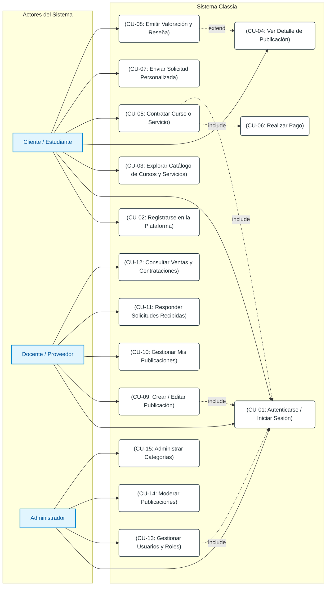

# Diagrama de Casos de Uso General — Classia · Segunda Entrega

## Resumen del Documento
Este documento especifica el **Diagrama de Casos de Uso General** para la plataforma **Classia**, representando cómo interactúan los distintos actores con el sistema. Se incorpora el estado de implementación de cada caso de uso al cierre de la segunda entrega funcional y técnica.

> **Última actualización:** Segunda entrega funcional y técnica (Sprint 2)  
> **Leyenda de estado:** ✅ Implementado | 🔄 En desarrollo / Frontend disponible | ❌ Pendiente

---

## Diagrama UML de Casos de Uso (Mermaid)

---

## Especificación de Actores

| Actor | Tipo | `id_rol` | Descripción |
| :--- | :--- | :---: | :--- |
| **Cliente / Estudiante** | Principal | 1 | Usuario que busca, explora, contrata cursos/servicios, realiza pagos y emite solicitudes o valoraciones personalizadas. |
| **Docente / Proveedor** | Principal | 2 | Usuario capacitador o profesional que crea, oferta y gestiona cursos y servicios, respondiendo a contrataciones y solicitudes. |
| **Administrador** | Principal | 3 | Usuario responsable de la gestión global del sistema, moderación de contenidos, administración de categorías y control de usuarios. |

---

## Matriz de Casos de Uso, Actores y Estado de Implementación

| ID | Caso de Uso | Cliente | Docente | Admin | Estado Sprint 2 | Componentes implementados |
| :---: | :--- | :---: | :---: | :---: | :---: | :--- |
| **CU-01** | Autenticarse / Iniciar Sesión | X | X | X | 🔄 | Vista: `login.php` · Backend: `session.php` (sesión) · Login contra BD: pendiente |
| **CU-02** | Registrarse en la Plataforma | X | X | | ✅ | Vista: `registro.php` · Backend: `php/usuarios/registro.php` · PDO INSERT `usuarios` |
| **CU-03** | Explorar Catálogo | X | X | X | ✅ | Vista: `catalogo.php` |
| **CU-04** | Ver Detalle de Publicación | X | X | X | ✅ | Vistas: `servicio-detalle.php`, `curso.php` |
| **CU-05** | Contratar Curso o Servicio | X | | | 🔄 | Vista: `carrito.php`, `confirmacion.php` · Backend `php/contrataciones/`: pendiente |
| **CU-06** | Realizar Pago | X | | | 🔄 | Vista: `pasarela-pago.php` (simulada) · Backend `php/pagos/`: pendiente |
| **CU-07** | Enviar Solicitud Personalizada | X | | | 🔄 | Vistas: `form-solicitar-servicio.php`, `solicitud-impresion-3d.php` · Backend `php/solicitudes/`: pendiente |
| **CU-08** | Emitir Valoración y Reseña | X | | | 🔄 | Vista: `valoracion.php` · Backend `php/valoraciones/`: pendiente |
| **CU-09** | Crear / Editar Publicación | | X | | ✅ | Vistas: `crear-publicacion.php`, `editar-publicacion.php` · Backend: `php/publicaciones/crear_publicacion.php`, `editar_publicacion.php` |
| **CU-10** | Gestionar Mis Publicaciones | | X | | ✅ | Vista: `panel-proveedor.php` · Helper: `obtener_publicaciones.php` (SELECT dinámico PDO) |
| **CU-11** | Responder Solicitudes | | X | | 🔄 | Panel proveedor (sección solicitudes estática) · Backend: pendiente |
| **CU-12** | Consultar Ventas | | X | | 🔄 | Panel proveedor (sección contrataciones estática) · Backend: pendiente |
| **CU-13** | Gestionar Usuarios y Roles | | | X | 🔄 | Vista: `panel-administrador.php` (estático) · Backend: pendiente |
| **CU-14** | Moderar Publicaciones | | | X | 🔄 | Panel administrador (estático) · Backend: pendiente |
| **CU-15** | Administrar Categorías | | | X | 🔄 | Panel administrador (estático) · Backend: pendiente |

---

## Resumen de Estado — Segunda Entrega

| Estado | Cantidad | Casos de uso |
|:---|:---:|:---|
| ✅ **Implementado completo** | 5 | CU-02, CU-03, CU-04, CU-09, CU-10 |
| 🔄 **Frontend disponible / Backend pendiente** | 10 | CU-01, CU-05, CU-06, CU-07, CU-08, CU-11, CU-12, CU-13, CU-14, CU-15 |
| ❌ **No iniciado** | 0 | — |
