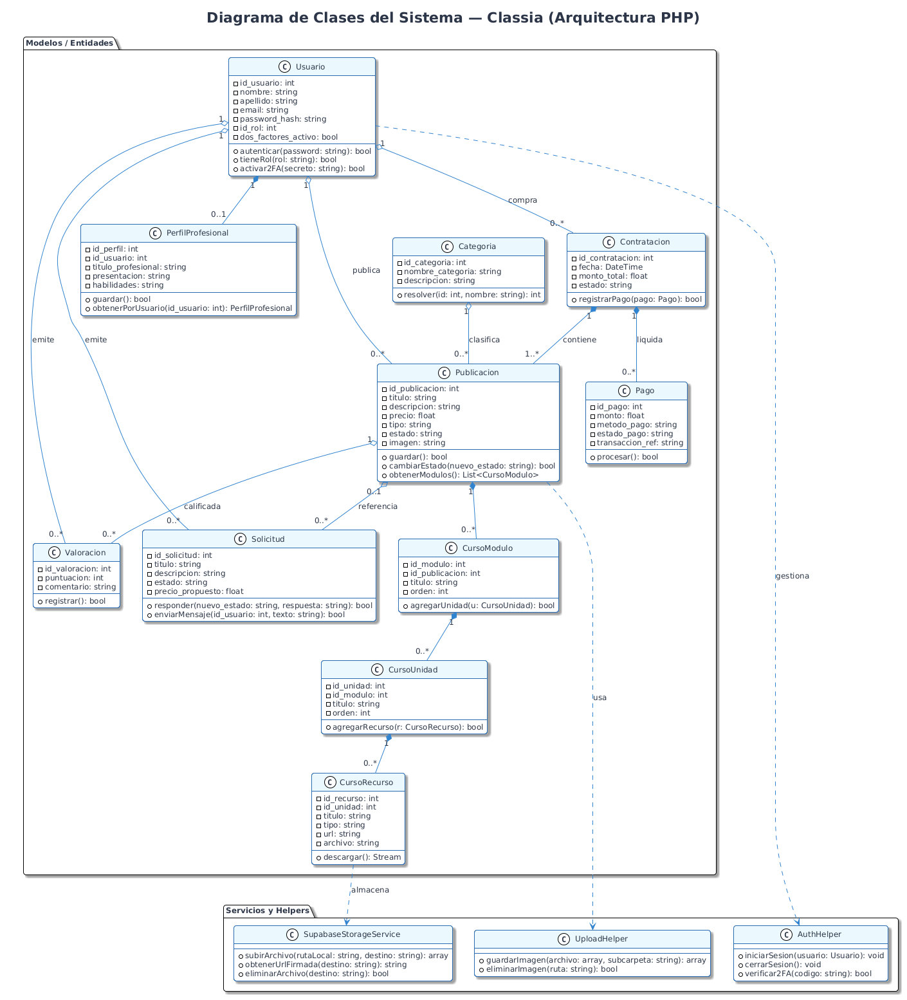
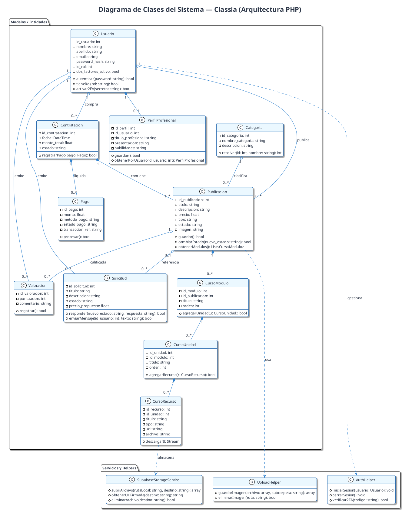

# Diagrama de Clases — Classia · Segunda Entrega (Sprint 3)

## Arquitectura de Clases y Servicios
El diagrama de clases modela la arquitectura de entidades, controladores y servicios auxiliares en PHP 8.

---

## Diagrama de Clases (PlantUML / draw.io)

*Versión vectorial:* [diagrama_de_clases_classia.svg](diagramas/diagrama_de_clases_classia.svg) | *Código fuente:* [diagrama_de_clases_classia.puml](diagramas/diagrama_de_clases_classia.puml)

### Código Fuente PlantUML

