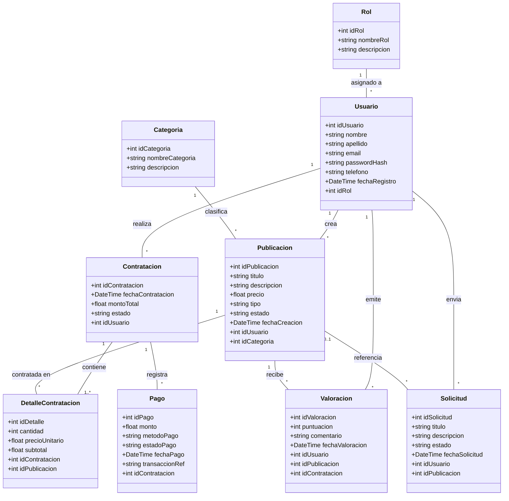

# Diagrama de Clases de Dominio - Classia

## Resumen del Documento
Este documento especifica el **Diagrama de Clases Inicial** para la plataforma **Classia**, diseñado en notación UML POO (Programación Orientada a Objetos). Define la estructura del dominio, los atributos de las entidades, las asociaciones y sus multiplicidades, garantizando coherencia directa con el Modelo Entidad-Relación (MER) y sirviendo como guía para el desarrollo del backend en PHP.

---

## Diagrama UML de Clases (Mermaid)

---

## Especificación de Clases y Atributos

### 1. `Rol`
Representa los tipos de perfil del sistema (Cliente/Estudiante, Docente/Proveedor, Admin).
- `idRol`: int (Identificador único)
- `nombreRol`: string (Nombre distintivo)
- `descripcion`: string (Detalle de permisos)

### 2. `Usuario`
Modela las cuentas de usuario de Classia.
- `idUsuario`: int (Identificador único)
- `nombre`: string
- `apellido`: string
- `email`: string
- `passwordHash`: string
- `telefono`: string (opcional)
- `fechaRegistro`: DateTime
- `idRol`: int (Asociación con el Rol)

### 3. `Categoria`
Clasificación temática de las publicaciones.
- `idCategoria`: int
- `nombreCategoria`: string
- `descripcion`: string

### 4. `Publicacion`
Representa un curso o servicio educativo publicado en la plataforma.
- `idPublicacion`: int
- `titulo`: string
- `descripcion`: string
- `precio`: float
- `tipo`: string ('Curso' | 'Servicio')
- `estado`: string ('Activo' | 'Inactivo' | 'Pausado')
- `fechaCreacion`: DateTime
- `idUsuario`: int (Docente/Proveedor creador)
- `idCategoria`: int

### 5. `Solicitud`
Peticiones a medida o presupuestos de un cliente hacia un docente.
- `idSolicitud`: int
- `titulo`: string
- `descripcion`: string
- `estado`: string ('Pendiente' | 'Aceptada' | 'Rechazada' | 'Cancelada')
- `fechaSolicitud`: DateTime
- `idUsuario`: int (Cliente solicitante)
- `idPublicacion`: int (Opcional)

### 6. `Contratacion`
Orden de compra o contratación realizada por un cliente.
- `idContratacion`: int
- `fechaContratacion`: DateTime
- `montoTotal`: float
- `estado`: string ('Pendiente' | 'En Proceso' | 'Completada' | 'Cancelada')
- `idUsuario`: int (Cliente comprador)

### 7. `DetalleContratacion`
Desglose de cada publicación agregada a la contratación.
- `idDetalle`: int
- `cantidad`: int
- `precioUnitario`: float
- `subtotal`: float
- `idContratacion`: int
- `idPublicacion`: int

### 8. `Pago`
Registro financiero del cobro/abono de una contratación.
- `idPago`: int
- `monto`: float
- `metodoPago`: string ('Tarjeta' | 'Transferencia' | 'MercadoPago' | 'Efectivo')
- `estadoPago`: string ('Pendiente' | 'Aprobado' | 'Rechazado')
- `fechaPago`: DateTime
- `transaccionRef`: string (opcional)
- `idContratacion`: int

### 9. `Valoracion`
Reseñas y puntajes otorgados por usuarios a publicaciones.
- `idValoracion`: int
- `puntuacion`: int (1 a 5)
- `comentario`: string (opcional)
- `fechaValoracion`: DateTime
- `idUsuario`: int
- `idPublicacion`: int
- `idContratacion`: int (opcional)

---

## Asociaciones y Multiplicidades

| Clase Origen | Multiplicidad | Clase Destino | Multiplicidad | Descripción |
| :--- | :---: | :--- | :---: | :--- |
| **Rol** | `1` | **Usuario** | `*` | Un rol es asignado a 0 o muchos usuarios. Todo usuario posee 1 rol. |
| **Usuario** | `1` | **Publicacion** | `*` | Un docente publica 0 o muchas ofertas. Toda publicación tiene 1 creador. |
| **Categoria** | `1` | **Publicacion** | `*` | Una categoría engloba 0 o muchas publicaciones. |
| **Usuario** | `1` | **Contratacion** | `*` | Un cliente realiza 0 o muchas contrataciones. |
| **Contratacion** | `1` | **DetalleContratacion** | `1..*` | Una contratación contiene al menos 1 línea de detalle. |
| **Publicacion** | `1` | **DetalleContratacion** | `*` | Una publicación puede contratarse en N órdenes. |
| **Contratacion** | `1` | **Pago** | `*` | Una contratación registra 0 o más intentos/comprobantes de pago. |
| **Usuario** | `1` | **Valoracion** | `*` | Un usuario emite 0 o muchas valoraciones. |
| **Publicacion** | `1` | **Valoracion** | `*` | Una publicación recibe 0 o muchas valoraciones. |
| **Usuario** | `1` | **Solicitud** | `*` | Un usuario envía 0 o muchas solicitudes. |
| **Publicacion** | `0..1` | **Solicitud** | `*` | Una solicitud puede referenciar opcionalmente 1 publicación. |

