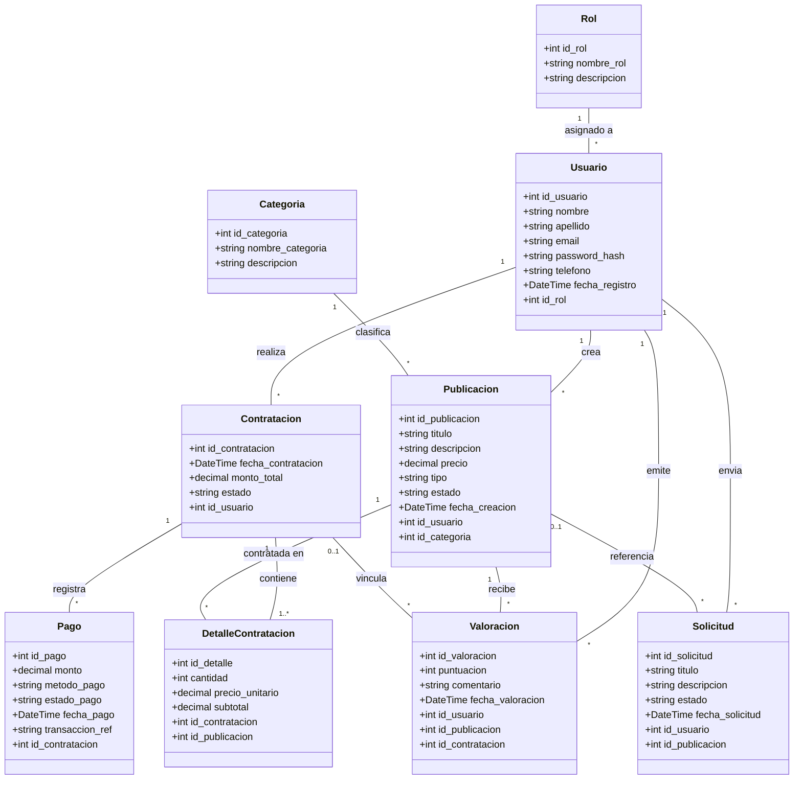

# Diagrama de Clases de Dominio — Classia · Segunda Entrega

## Resumen del Documento
Este documento especifica el **Diagrama de Clases de Dominio** para la plataforma **Classia**, diseñado en notación UML POO (Programación Orientada a Objetos). Define la estructura del dominio, los atributos de las entidades, las asociaciones y sus multiplicidades, garantizando coherencia directa con el Modelo Entidad-Relación (MER) y el esquema físico `sql/schema.sql`. La nomenclatura de atributos usa `snake_case` conforme a la base de datos real.

> **Última actualización:** Segunda entrega funcional y técnica (Sprint 2)  
> **Coherencia validada contra:** `sql/schema.sql` y `docs/mer_classia.md`

---

## Diagrama UML de Clases (Mermaid)

---

## Especificación de Clases y Atributos

### 1. `Rol`
Representa los tipos de perfil del sistema. Tabla física: `roles`. Datos semilla: `id_rol=1` (Cliente/Estudiante), `id_rol=2` (Docente/Proveedor), `id_rol=3` (Administrador).
- `id_rol`: int — Identificador único
- `nombre_rol`: string — Nombre distintivo
- `descripcion`: string — Detalle de permisos

### 2. `Usuario`
Modela las cuentas de usuario de Classia. Tabla física: `usuarios`.
- `id_usuario`: int — Identificador único
- `nombre`: string
- `apellido`: string
- `email`: string — UNIQUE; usado para login
- `password_hash`: string — Hash bcrypt (`password_hash()`)
- `telefono`: string (opcional)
- `fecha_registro`: DateTime
- `id_rol`: int — FK → `roles(id_rol)`

### 3. `Categoria`
Clasificación temática de las publicaciones. Tabla física: `categorias`.
- `id_categoria`: int
- `nombre_categoria`: string — UNIQUE
- `descripcion`: string

### 4. `Publicacion`
Representa un curso o servicio educativo. Tabla física: `publicaciones`.
- `id_publicacion`: int
- `titulo`: string
- `descripcion`: string
- `precio`: decimal — DECIMAL(10,2)
- `tipo`: string — ENUM('Curso' | 'Servicio')
- `estado`: string — ENUM('Activo' | 'Inactivo' | 'Pausado')
- `fecha_creacion`: DateTime
- `id_usuario`: int — FK → `usuarios` (Docente/Proveedor creador)
- `id_categoria`: int — FK → `categorias`

### 5. `Solicitud`
Peticiones a medida o presupuestos de un cliente hacia un docente. Implementa el flujo de **solicitud docente**. Tabla física: `solicitudes`.
- `id_solicitud`: int
- `titulo`: string
- `descripcion`: string
- `estado`: string — ENUM('Pendiente' | 'Aceptada' | 'Rechazada' | 'Cancelada')
- `fecha_solicitud`: DateTime
- `id_usuario`: int — FK → `usuarios` (Cliente solicitante)
- `id_publicacion`: int — FK → `publicaciones` (opcional; NULL si es consulta general)

### 6. `Contratacion`
Orden de compra o contratación realizada por un cliente. Tabla física: `contrataciones`.
- `id_contratacion`: int
- `fecha_contratacion`: DateTime
- `monto_total`: decimal — DECIMAL(10,2)
- `estado`: string — ENUM('Pendiente' | 'En Proceso' | 'Completada' | 'Cancelada')
- `id_usuario`: int — FK → `usuarios` (Cliente comprador)

### 7. `DetalleContratacion`
Desglose de cada publicación agregada a la contratación. Tabla física: `detalles_contratacion`.
- `id_detalle`: int
- `cantidad`: int
- `precio_unitario`: decimal — DECIMAL(10,2)
- `subtotal`: decimal — `cantidad × precio_unitario`
- `id_contratacion`: int — FK → `contrataciones`
- `id_publicacion`: int — FK → `publicaciones`

### 8. `Pago`
Registro financiero del cobro/abono de una contratación. Tabla física: `pagos`.
- `id_pago`: int
- `monto`: decimal — DECIMAL(10,2)
- `metodo_pago`: string — ENUM('Tarjeta' | 'Transferencia' | 'MercadoPago' | 'Efectivo')
- `estado_pago`: string — ENUM('Pendiente' | 'Aprobado' | 'Rechazado')
- `fecha_pago`: DateTime
- `transaccion_ref`: string (opcional)
- `id_contratacion`: int — FK → `contrataciones`

### 9. `Valoracion`
Reseñas y puntajes otorgados por usuarios a publicaciones. Tabla física: `valoraciones`.
- `id_valoracion`: int
- `puntuacion`: int — CHECK (1 a 5)
- `comentario`: string (opcional)
- `fecha_valoracion`: DateTime
- `id_usuario`: int — FK → `usuarios`
- `id_publicacion`: int — FK → `publicaciones`
- `id_contratacion`: int — FK → `contrataciones` (opcional; vincula contratación verificada)

---

## Asociaciones y Multiplicidades

| Clase Origen | Multiplicidad | Clase Destino | Multiplicidad | Descripción |
| :--- | :---: | :--- | :---: | :--- |
| **Rol** | `1` | **Usuario** | `*` | Un rol es asignado a 0 o muchos usuarios. Todo usuario posee 1 rol. |
| **Usuario** | `1` | **Publicacion** | `*` | Un docente publica 0 o muchas ofertas. Toda publicación tiene 1 creador. |
| **Categoria** | `1` | **Publicacion** | `*` | Una categoría engloba 0 o muchas publicaciones. |
| **Usuario** | `1` | **Contratacion** | `*` | Un cliente realiza 0 o muchas contrataciones. |
| **Contratacion** | `1` | **DetalleContratacion** | `1..*` | Una contratación contiene al menos 1 línea de detalle. |
| **Publicacion** | `1` | **DetalleContratacion** | `*` | Una publicación puede contratarse en N órdenes. |
| **Contratacion** | `1` | **Pago** | `*` | Una contratación registra 0 o más intentos/comprobantes de pago. |
| **Usuario** | `1` | **Valoracion** | `*` | Un usuario emite 0 o muchas valoraciones. |
| **Publicacion** | `1` | **Valoracion** | `*` | Una publicación recibe 0 o muchas valoraciones. |
| **Contratacion** | `0..1` | **Valoracion** | `*` | Una valoración puede vincularse opcionalmente a una contratación verificada. |
| **Usuario** | `1` | **Solicitud** | `*` | Un usuario envía 0 o muchas solicitudes. |
| **Publicacion** | `0..1` | **Solicitud** | `*` | Una solicitud puede referenciar opcionalmente 1 publicación (flujo solicitud docente). |

