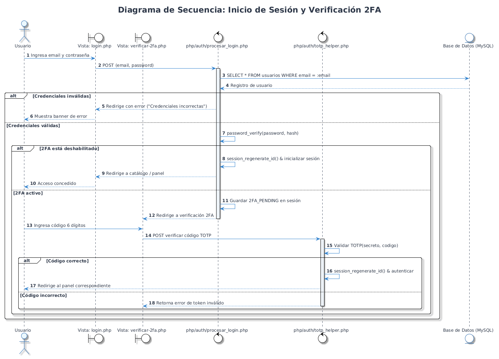
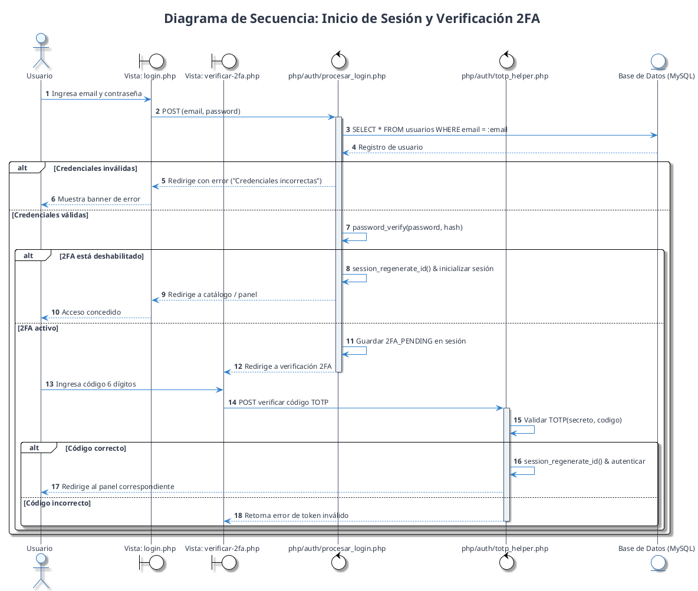
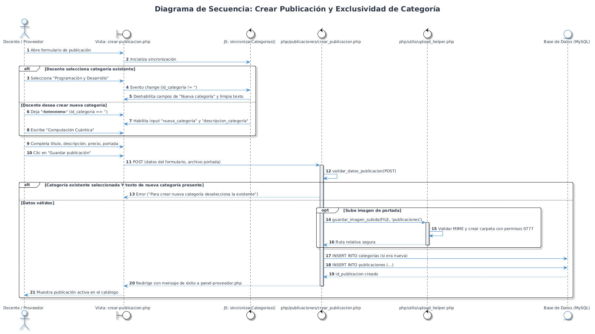
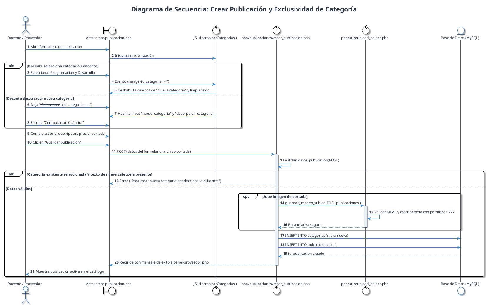
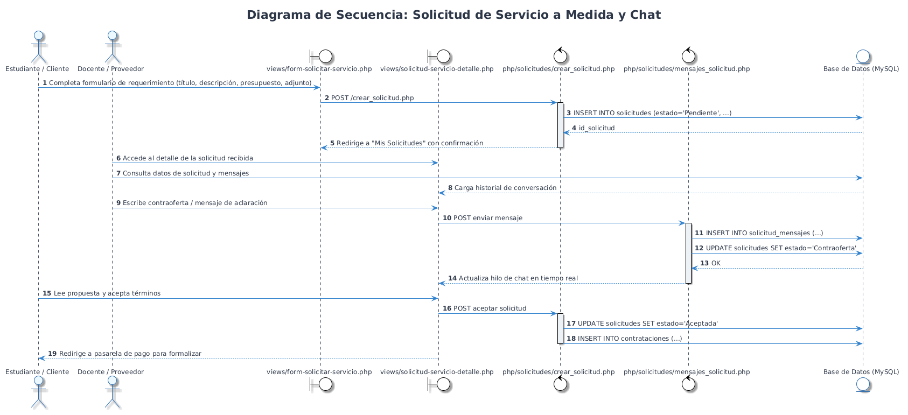
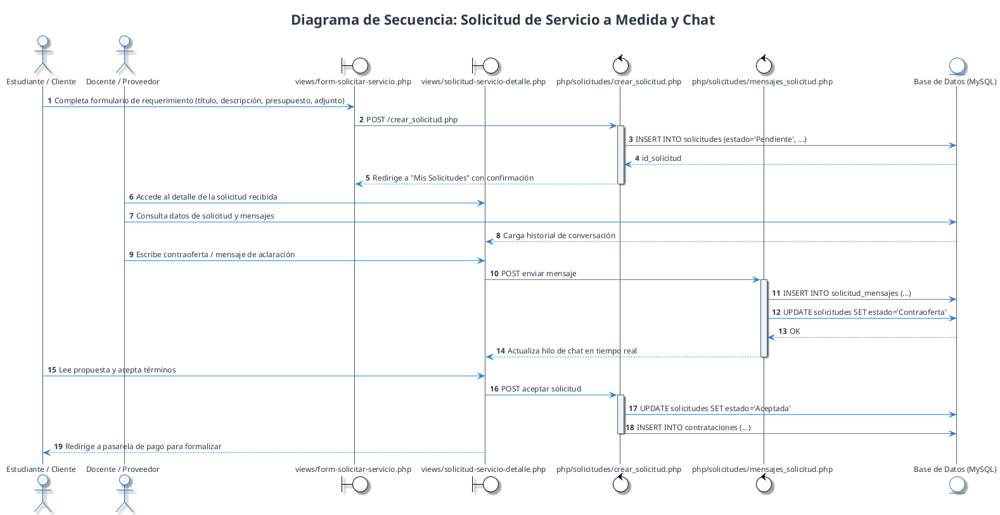
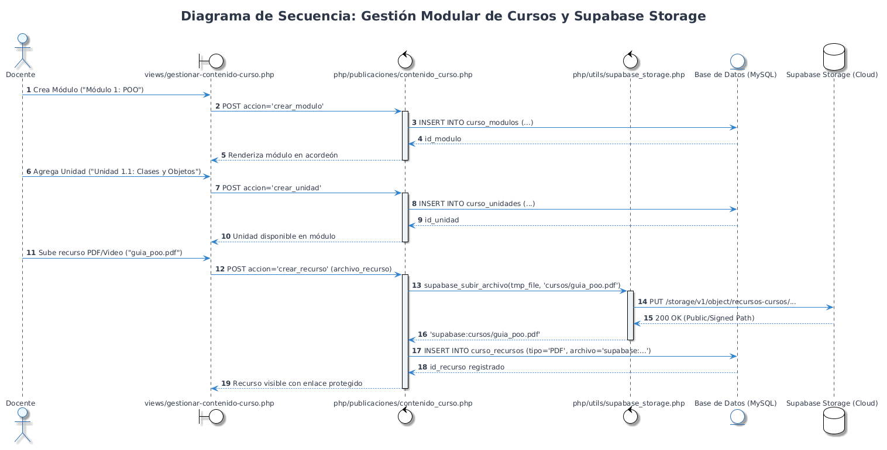
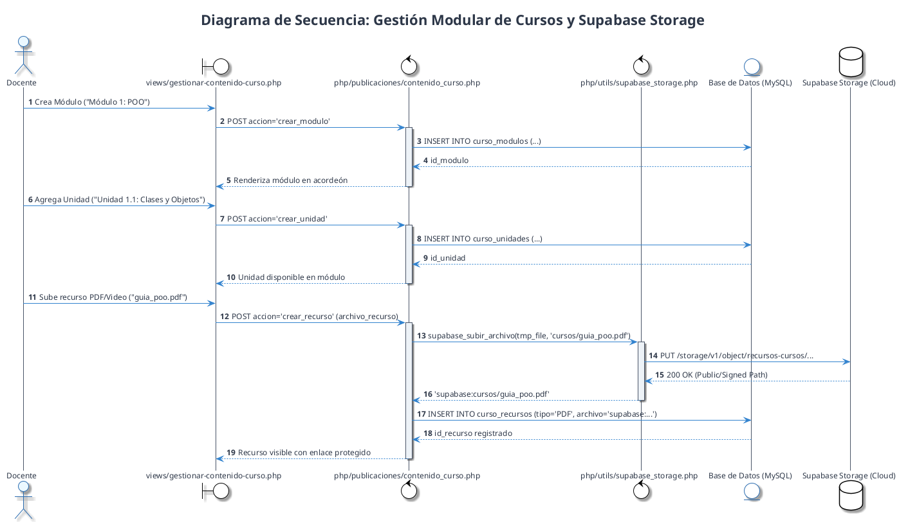

# Diagramas de Secuencia — Classia · Segunda Entrega (Sprint 3)

Este documento contiene los diagramas de secuencia representativos de los principales flujos del sistema en el **Sprint 3**.

---

## 1. Flujo de Autenticación y Verificación en Dos Pasos (2FA)

*Versión vectorial:* [secuencia_autenticacion_2fa.svg](diagramas/secuencia_autenticacion_2fa.svg)

---

## 2. Flujo de Creación de Publicación y Exclusividad de Categoría

*Versión vectorial:* [secuencia_crear_publicacion.svg](diagramas/secuencia_crear_publicacion.svg)

---

## 3. Flujo de Solicitud de Servicio a Medida y Negociación

*Versión vectorial:* [secuencia_solicitud_servicio.svg](diagramas/secuencia_solicitud_servicio.svg)

---

## 4. Flujo de Gestión de Contenido de Cursos y Supabase Storage

*Versión vectorial:* [secuencia_gestion_curso_supabase.svg](diagramas/secuencia_gestion_curso_supabase.svg)

