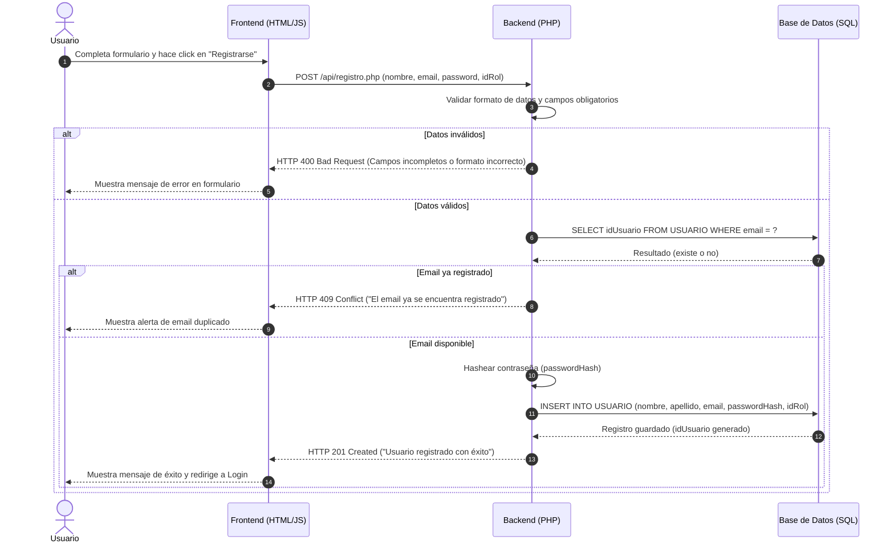
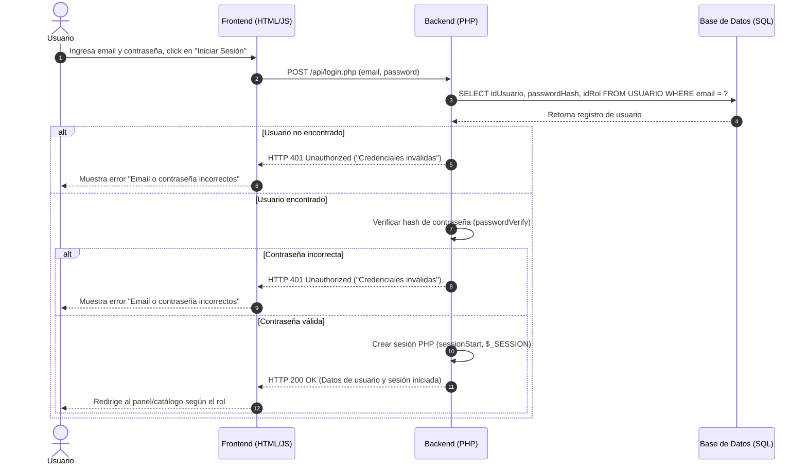
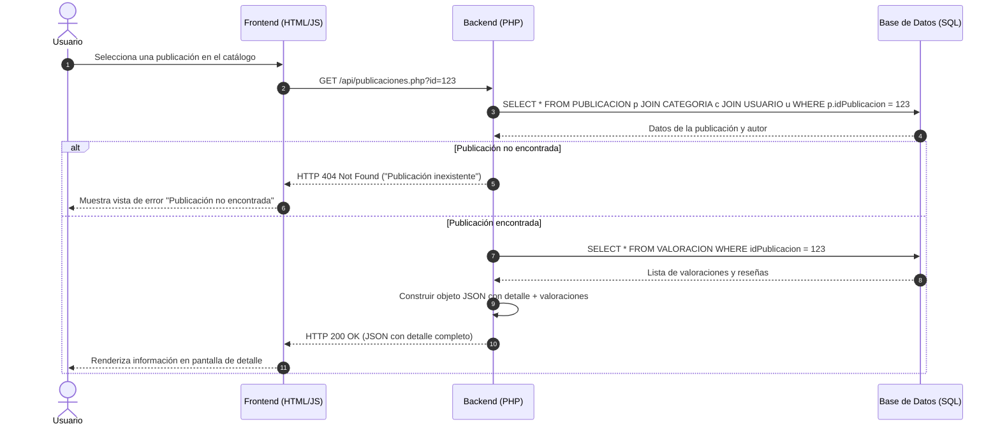
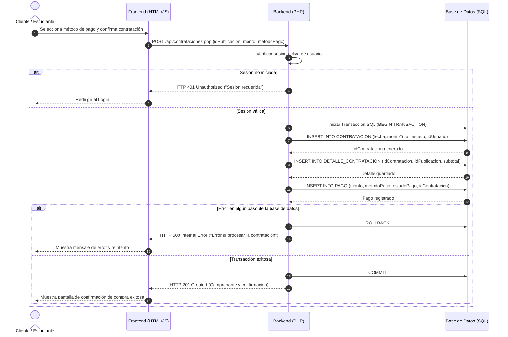
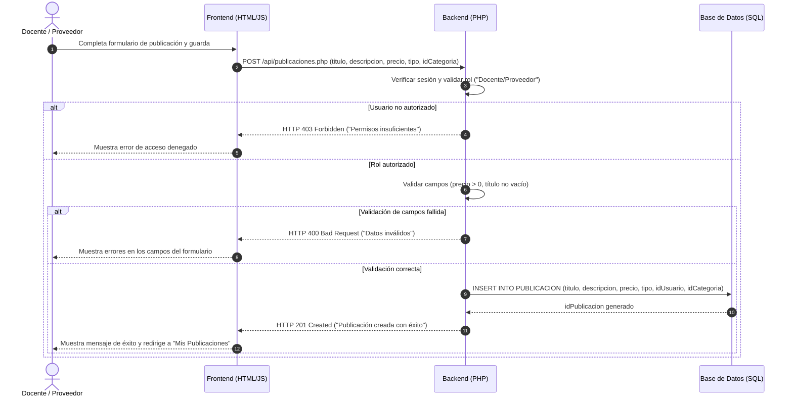

# Diagramas de Secuencia UML - Classia

## Resumen del Documento
Este documento especifica los **Diagramas de Secuencia UML** para los flujos principales de la plataforma **Classia**. Detalla la interacción paso a paso entre el **Usuario (Frontend)**, la capa de aplicación **Backend (PHP)** y la capa de persistencia **Base de Datos (MariaDB/MySQL)**, contemplando respuestas exitosas y flujos alternativos de error.

---

## 1. Flujo: Registro de Usuario

---

## 2. Flujo: Inicio de Sesión (Login)

---

## 3. Flujo: Consulta de una Publicación (Ver Detalle)

---

## 4. Flujo: Contratación de un Curso o Servicio

---

## 5. Flujo: Publicación de Curso o Servicio por un Proveedor

---

## Matriz de Coherencia con Casos de Uso y Backend

| Flujo de Secuencia | Caso de Uso Asociado | Tablas Afectadas en BD | Controlador Backend PHP Recomendado |
| :--- | :--- | :--- | :--- |
| **1. Registro** | `CU-02: Registrarse` | `USUARIO`, `ROL` | `RegistroController.php` |
| **2. Login** | `CU-01: Autenticarse` | `USUARIO` | `AuthController.php` |
| **3. Consulta Publicación** | `CU-04: Ver Detalle` | `PUBLICACION`, `CATEGORIA`, `VALORACION` | `PublicacionController.php` |
| **4. Contratación** | `CU-05: Contratar` + `CU-06: Pagar` | `CONTRATACION`, `DETALLE_CONTRATACION`, `PAGO` | `ContratacionController.php` |
| **5. Nueva Publicación** | `CU-09: Crear Publicación` | `PUBLICACION` | `PublicacionController.php` |
