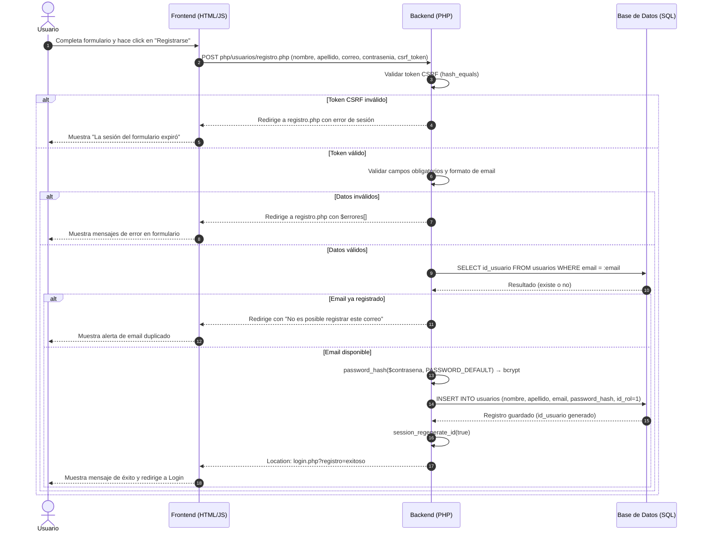
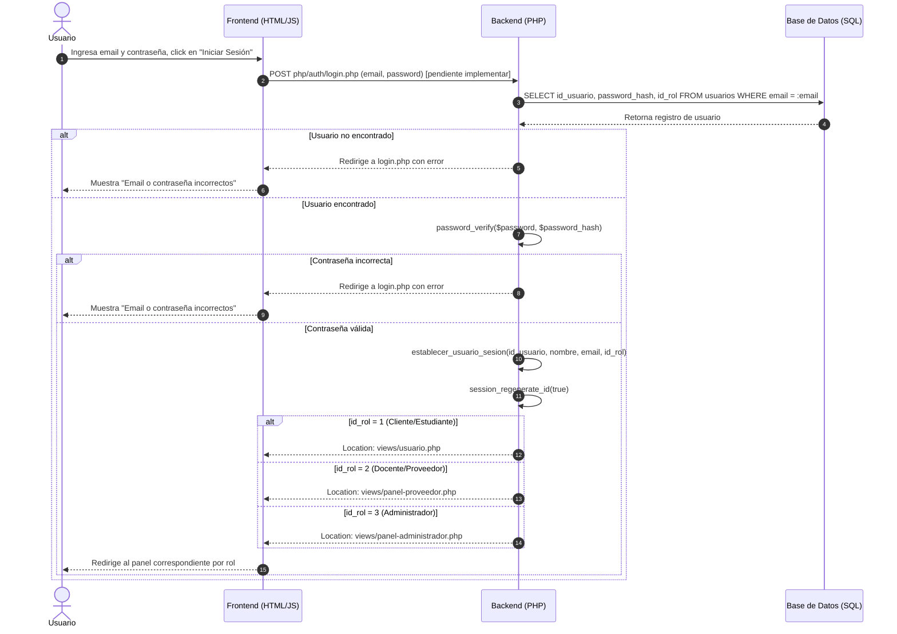
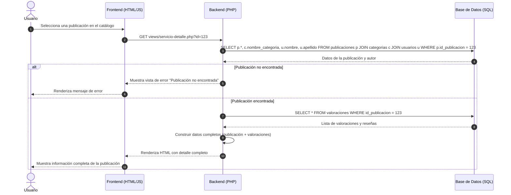
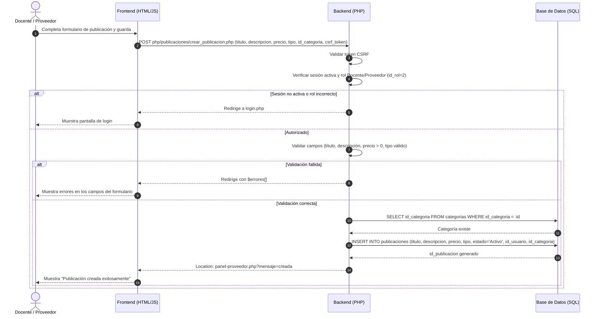
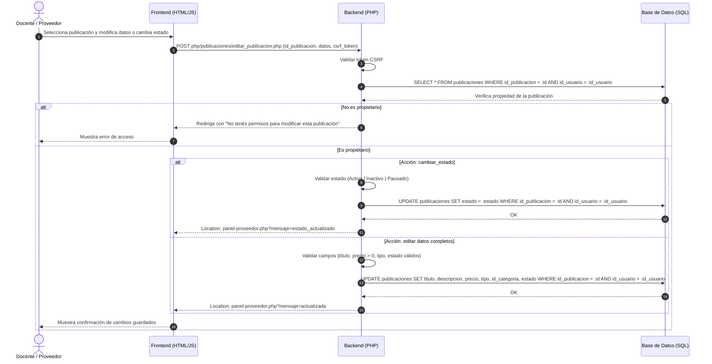
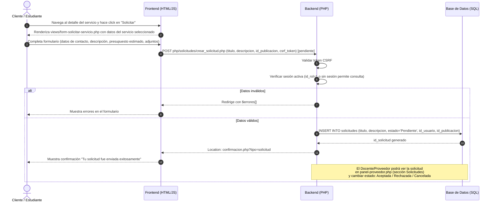
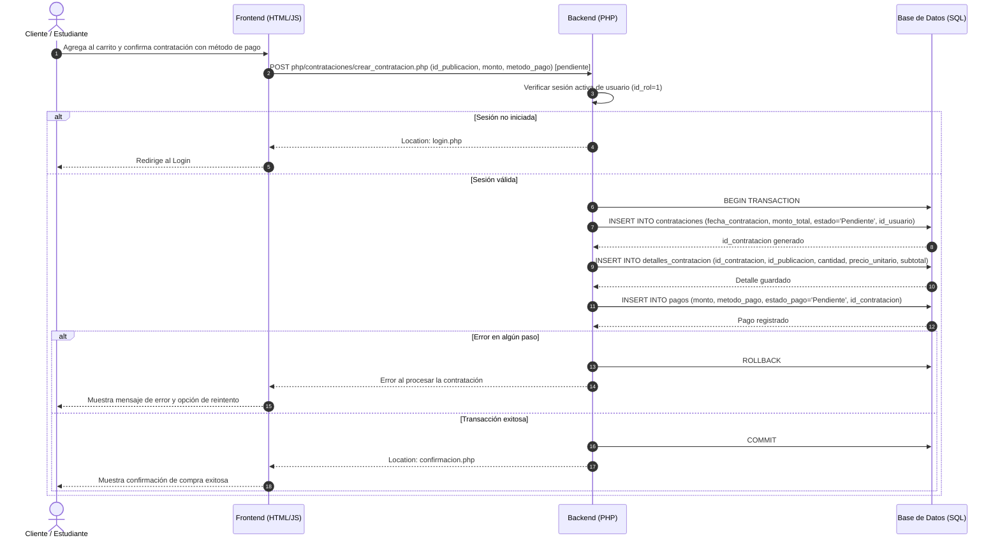

# Diagramas de Secuencia UML — Classia · Segunda Entrega

## Resumen del Documento
Este documento especifica los **Diagramas de Secuencia UML** para los flujos principales de la plataforma **Classia**. Detalla la interacción paso a paso entre el **Usuario (Frontend)**, la capa **Backend (PHP)** y la **Base de Datos (MariaDB/MySQL)**, contemplando respuestas exitosas y flujos alternativos de error.

> **Última actualización:** Segunda entrega funcional y técnica (Sprint 2)  
> **Leyenda:** ✅ Implementado | 🔄 Vista disponible, backend pendiente

---

## 1. Flujo: Registro de Usuario ✅

**Archivos involucrados:** `views/registro.php` · `php/usuarios/registro.php` · `config/database.php` · tabla `usuarios`

---

## 2. Flujo: Inicio de Sesión (Login) 🔄

**Archivos involucrados:** `views/login.php` · `php/auth/session.php` · `php/auth/login.php` (pendiente) · tabla `usuarios`

---

## 3. Flujo: Consulta de una Publicación (Ver Detalle) ✅

**Archivos involucrados:** `views/servicio-detalle.php` · `views/curso.php` · tablas `publicaciones`, `categorias`, `usuarios`, `valoraciones`

---

## 4. Flujo: Creación de Publicación por Docente ✅

**Archivos involucrados:** `views/crear-publicacion.php` · `php/publicaciones/crear_publicacion.php` · `config/database.php` · tabla `publicaciones`

---

## 5. Flujo: Edición / Cambio de Estado de Publicación ✅

**Archivos involucrados:** `views/editar-publicacion.php` · `php/publicaciones/editar_publicacion.php` · tabla `publicaciones`

---

## 6. Flujo: Envío de Solicitud Personalizada (Solicitud Docente) 🔄

**Archivos involucrados:** `views/form-solicitar-servicio.php` · `views/solicitud-impresion-3d.php` · `php/solicitudes/crear_solicitud.php` (pendiente) · tabla `solicitudes`

---

## 7. Flujo: Contratación de un Curso o Servicio 🔄

**Archivos involucrados:** `views/carrito.php` · `views/pasarela-pago.php` · `views/confirmacion.php` · `php/contrataciones/crear_contratacion.php` (pendiente) · tablas `contrataciones`, `detalles_contratacion`, `pagos`

---

## Matriz de Coherencia con Casos de Uso y Backend

| Flujo de Secuencia | Caso de Uso | Estado | Tablas Afectadas | Controlador PHP |
| :--- | :--- | :---: | :--- | :--- |
| **1. Registro** | CU-02: Registrarse | ✅ | `usuarios` | `php/usuarios/registro.php` |
| **2. Login** | CU-01: Autenticarse | 🔄 | `usuarios` | `php/auth/login.php` (pendiente) |
| **3. Ver Publicación** | CU-04: Ver Detalle | ✅ | `publicaciones`, `categorias`, `valoraciones` | vistas directas |
| **4. Crear Publicación** | CU-09: Crear Publicación | ✅ | `publicaciones` | `php/publicaciones/crear_publicacion.php` |
| **5. Editar Publicación** | CU-09 + CU-10 | ✅ | `publicaciones` | `php/publicaciones/editar_publicacion.php` |
| **6. Solicitud Docente** | CU-07: Enviar Solicitud | 🔄 | `solicitudes` | `php/solicitudes/crear_solicitud.php` (pendiente) |
| **7. Contratación** | CU-05 + CU-06 | 🔄 | `contrataciones`, `detalles_contratacion`, `pagos` | `php/contrataciones/` (pendiente) |
