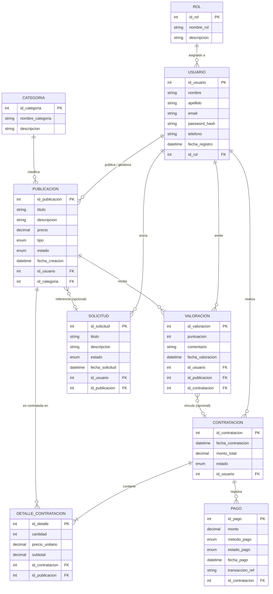

# Modelo Entidad-Relación (MER) — Classia · Segunda Entrega

## Resumen del Modelo
Este documento especifica el **Modelo Entidad-Relación (MER) actualizado** para la plataforma **Classia**, reflejando el estado real del sistema al cierre de la segunda entrega funcional y técnica. La nomenclatura de atributos coincide exactamente con el esquema físico definido en [`sql/schema.sql`](../sql/schema.sql) (convención `snake_case` de MariaDB/MySQL).

> **Última actualización:** Segunda entrega funcional y técnica (Sprint 2)  
> **Coherencia validada contra:** `sql/schema.sql`

---

## Diagrama Entidad-Relación (Mermaid ERD)

---

## Diccionario de Entidades y Atributos

### 1. Entidad: ROL
Representa los perfiles de usuario permitidos en la plataforma. Implementado como tabla `roles` en la BD.

| Atributo | Tipo físico | Restricción | Descripción |
|:---|:---|:---|:---|
| `id_rol` | `INT` AUTO_INCREMENT | `PRIMARY KEY` | Identificador único del rol. |
| `nombre_rol` | `VARCHAR(50)` | `NOT NULL UNIQUE` | Nombre del rol (`'Cliente/Estudiante'`, `'Docente/Proveedor'`, `'Administrador'`). |
| `descripcion` | `VARCHAR(255)` | `NULL` | Explicación breve de los permisos. |

**Roles semilla (datos iniciales en BD):**

| `id_rol` | `nombre_rol` | Descripción |
|:---:|:---|:---|
| 1 | `Cliente/Estudiante` | Usuario consumidor de cursos y servicios |
| 2 | `Docente/Proveedor` | Usuario creador y prestador de servicios educativos |
| 3 | `Administrador` | Superusuario del sistema |

---

### 2. Entidad: USUARIO
Almacena las cuentas de usuario de la plataforma. Tabla física: `usuarios`.

| Atributo | Tipo físico | Restricción | Descripción |
|:---|:---|:---|:---|
| `id_usuario` | `INT` AUTO_INCREMENT | `PRIMARY KEY` | Identificador único. |
| `nombre` | `VARCHAR(100)` | `NOT NULL` | Nombre de la persona. |
| `apellido` | `VARCHAR(100)` | `NOT NULL` | Apellido del usuario. |
| `email` | `VARCHAR(150)` | `NOT NULL UNIQUE` | Correo electrónico; usado para login. |
| `password_hash` | `VARCHAR(255)` | `NOT NULL` | Hash bcrypt de la contraseña (`password_hash()`). |
| `telefono` | `VARCHAR(30)` | `NULL` | Teléfono de contacto (opcional). |
| `fecha_registro` | `DATETIME` | `NOT NULL DEFAULT CURRENT_TIMESTAMP` | Fecha/hora de creación. |
| `id_rol` | `INT` | `NOT NULL FK → roles(id_rol)` | Rol asignado al usuario. |

---

### 3. Entidad: CATEGORIA
Agrupa y clasifica los cursos y servicios ofrecidos. Tabla física: `categorias`.

| Atributo | Tipo físico | Restricción | Descripción |
|:---|:---|:---|:---|
| `id_categoria` | `INT` AUTO_INCREMENT | `PRIMARY KEY` | Identificador único. |
| `nombre_categoria` | `VARCHAR(100)` | `NOT NULL UNIQUE` | Nombre (ej. `'Programación y Desarrollo'`). |
| `descripcion` | `TEXT` | `NULL` | Detalles de la categoría. |

**10 categorías semilla disponibles:** Programación y Desarrollo, Robótica y Automatización, Diseño e Impresión 3D, Mentorías y Capacitación, Inteligencia Artificial y Datos, Electrónica y Microcontroladores, Ciberseguridad y Redes, Diseño Web y UX/UI, Idiomas y Comunicación Técnica, Gestión de Proyectos Tecnológicos.

---

### 4. Entidad: PUBLICACION
Representa un curso o servicio ofertado en Classia. Tabla física: `publicaciones`.

| Atributo | Tipo físico | Restricción | Descripción |
|:---|:---|:---|:---|
| `id_publicacion` | `INT` AUTO_INCREMENT | `PRIMARY KEY` | Identificador único. |
| `titulo` | `VARCHAR(200)` | `NOT NULL` | Título de la oferta. |
| `descripcion` | `TEXT` | `NOT NULL` | Descripción detallada. |
| `precio` | `DECIMAL(10,2)` | `NOT NULL` | Costo base. |
| `tipo` | `ENUM('Curso','Servicio')` | `NOT NULL` | Tipo de oferta. |
| `estado` | `ENUM('Activo','Inactivo','Pausado')` | `NOT NULL DEFAULT 'Activo'` | Estado de disponibilidad. |
| `fecha_creacion` | `DATETIME` | `NOT NULL DEFAULT CURRENT_TIMESTAMP` | Fecha de publicación. |
| `id_usuario` | `INT` | `NOT NULL FK → usuarios(id_usuario)` | Docente/Proveedor autor. |
| `id_categoria` | `INT` | `NOT NULL FK → categorias(id_categoria)` | Categoría técnica. |

---

### 5. Entidad: SOLICITUD
Permite a los estudiantes solicitar presupuestos o adaptaciones personalizadas. Equivale al flujo de *"solicitud docente"* del sistema. Tabla física: `solicitudes`.

| Atributo | Tipo físico | Restricción | Descripción |
|:---|:---|:---|:---|
| `id_solicitud` | `INT` AUTO_INCREMENT | `PRIMARY KEY` | Identificador único. |
| `titulo` | `VARCHAR(200)` | `NOT NULL` | Asunto o título de la solicitud. |
| `descripcion` | `TEXT` | `NOT NULL` | Requerimiento particular del estudiante. |
| `estado` | `ENUM('Pendiente','Aceptada','Rechazada','Cancelada')` | `NOT NULL DEFAULT 'Pendiente'` | Estado del ciclo de vida. |
| `fecha_solicitud` | `DATETIME` | `NOT NULL DEFAULT CURRENT_TIMESTAMP` | Fecha de envío. |
| `id_usuario` | `INT` | `NOT NULL FK → usuarios(id_usuario)` | Estudiante/Cliente que realiza la solicitud. |
| `id_publicacion` | `INT` | `NULL FK → publicaciones(id_publicacion)` | Publicación referenciada (opcional; nulo si es consulta general). |

> **Nota:** La entidad `SOLICITUD` es la que implementa el flujo documentado en [`views/form-solicitar-servicio.php`](../views/form-solicitar-servicio.php). La lógica backend en `php/solicitudes/` está planificada para entrega posterior.

---

### 6. Entidad: CONTRATACION
Registra la orden de compra de uno o varios servicios/cursos. Tabla física: `contrataciones`.

| Atributo | Tipo físico | Restricción | Descripción |
|:---|:---|:---|:---|
| `id_contratacion` | `INT` AUTO_INCREMENT | `PRIMARY KEY` | Identificador único. |
| `fecha_contratacion` | `DATETIME` | `NOT NULL DEFAULT CURRENT_TIMESTAMP` | Fecha del pedido. |
| `monto_total` | `DECIMAL(10,2)` | `NOT NULL` | Suma total de los ítems contratados. |
| `estado` | `ENUM('Pendiente','En Proceso','Completada','Cancelada')` | `NOT NULL DEFAULT 'Pendiente'` | Estado de la contratación. |
| `id_usuario` | `INT` | `NOT NULL FK → usuarios(id_usuario)` | Estudiante/Cliente comprador. |

---

### 7. Entidad: DETALLE_CONTRATACION
Desglosa cada ítem contratado dentro de una orden. Tabla física: `detalles_contratacion`.

| Atributo | Tipo físico | Restricción | Descripción |
|:---|:---|:---|:---|
| `id_detalle` | `INT` AUTO_INCREMENT | `PRIMARY KEY` | Identificador único. |
| `cantidad` | `INT` | `NOT NULL DEFAULT 1` | Cantidad o cupos. |
| `precio_unitario` | `DECIMAL(10,2)` | `NOT NULL` | Precio al momento de la contratación. |
| `subtotal` | `DECIMAL(10,2)` | `NOT NULL` | `cantidad × precio_unitario`. |
| `id_contratacion` | `INT` | `NOT NULL FK → contrataciones(id_contratacion)` | Cabecera de la orden. |
| `id_publicacion` | `INT` | `NOT NULL FK → publicaciones(id_publicacion)` | Publicación contratada. |

---

### 8. Entidad: PAGO
Registra los desembolsos asociados a una contratación. Tabla física: `pagos`.

| Atributo | Tipo físico | Restricción | Descripción |
|:---|:---|:---|:---|
| `id_pago` | `INT` AUTO_INCREMENT | `PRIMARY KEY` | Identificador único. |
| `monto` | `DECIMAL(10,2)` | `NOT NULL` | Monto abonado. |
| `metodo_pago` | `ENUM('Tarjeta','Transferencia','MercadoPago','Efectivo')` | `NOT NULL` | Método de pago. |
| `estado_pago` | `ENUM('Pendiente','Aprobado','Rechazado')` | `NOT NULL DEFAULT 'Pendiente'` | Estado del pago. |
| `fecha_pago` | `DATETIME` | `NOT NULL DEFAULT CURRENT_TIMESTAMP` | Fecha del intento de pago. |
| `transaccion_ref` | `VARCHAR(100)` | `NULL` | Código de comprobante / referencia del gateway. |
| `id_contratacion` | `INT` | `NOT NULL FK → contrataciones(id_contratacion)` | Contratación a la que aplica. |

---

### 9. Entidad: VALORACION
Reseñas y puntuaciones que realizan los usuarios sobre cursos/servicios. Tabla física: `valoraciones`.

| Atributo | Tipo físico | Restricción | Descripción |
|:---|:---|:---|:---|
| `id_valoracion` | `INT` AUTO_INCREMENT | `PRIMARY KEY` | Identificador único. |
| `puntuacion` | `INT` | `NOT NULL CHECK (1–5)` | Puntaje numérico del 1 al 5. |
| `comentario` | `TEXT` | `NULL` | Opinión escrita (opcional). |
| `fecha_valoracion` | `DATETIME` | `NOT NULL DEFAULT CURRENT_TIMESTAMP` | Fecha de la reseña. |
| `id_usuario` | `INT` | `NOT NULL FK → usuarios(id_usuario)` | Usuario que emite la valoración. |
| `id_publicacion` | `INT` | `NOT NULL FK → publicaciones(id_publicacion)` | Publicación evaluada. |
| `id_contratacion` | `INT` | `NULL FK → contrataciones(id_contratacion)` | Contratación verificada (opcional). |

---

## Relaciones y Cardinalidades

| Entidad Origen | Cardinalidad | Entidad Destino | Descripción de la Relación |
| :--- | :---: | :--- | :--- |
| **ROL** | `1 : N` | **USUARIO** | Un rol puede ser asignado a muchos usuarios. Todo usuario tiene obligatoriamente 1 rol. |
| **USUARIO** | `1 : N` | **PUBLICACION** | Un docente/proveedor publica N ofertas. Toda publicación tiene 1 único usuario creador. |
| **CATEGORIA** | `1 : N` | **PUBLICACION** | Una categoría engloba N publicaciones. Toda publicación pertenece a 1 categoría. |
| **USUARIO** | `1 : N` | **CONTRATACION** | Un estudiante realiza N contrataciones. Toda contratación pertenece a 1 usuario. |
| **CONTRATACION** | `1 : N` | **DETALLE_CONTRATACION** | Una contratación contiene al menos 1 detalle. Cada detalle pertenece a 1 única contratación. |
| **PUBLICACION** | `1 : N` | **DETALLE_CONTRATACION** | Una publicación puede contratarse en N detalles. Cada detalle refiere a 1 publicación. |
| **CONTRATACION** | `1 : N` | **PAGO** | Una contratación puede tener 1 o más registros de pago. Cada pago pertenece a 1 contratación. |
| **USUARIO** | `1 : N` | **VALORACION** | Un usuario puede emitir N valoraciones. Toda valoración pertenece a 1 autor. |
| **PUBLICACION** | `1 : N` | **VALORACION** | Una publicación recibe N valoraciones. Cada valoración aplica a 1 publicación. |
| **CONTRATACION** | `0..1 : N` | **VALORACION** | Una valoración puede vincularse opcionalmente a una contratación verificada. |
| **USUARIO** | `1 : N` | **SOLICITUD** | Un usuario envía N solicitudes. Toda solicitud la realiza 1 usuario. |
| **PUBLICACION** | `0..1 : N` | **SOLICITUD** | Una solicitud puede referenciar opcionalmente a 1 publicación específica. |

---

## Cumplimiento de Criterios de Aceptación (Segunda Entrega)

1. **Entidades representadas:** 9 entidades (`ROL`, `USUARIO`, `CATEGORIA`, `PUBLICACION`, `SOLICITUD`, `CONTRATACION`, `DETALLE_CONTRATACION`, `PAGO`, `VALORACION`).
2. **Nomenclatura coherente con BD:** Todos los atributos usan `snake_case` conforme a `schema.sql`.
3. **Roles documentados:** Los 3 roles del sistema están identificados con sus `id_rol` correspondientes.
4. **Solicitudes incorporadas:** La entidad `SOLICITUD` documenta el flujo de solicitud docente (`form-solicitar-servicio.php`).
5. **Cardinalidades definidas:** Todas las asociaciones cuentan con cardinalidades mínimas y máximas unívocas.
6. **Derivación relacional directa:** Cada FK surge de la regla de migración de claves de relaciones `1:N`.
