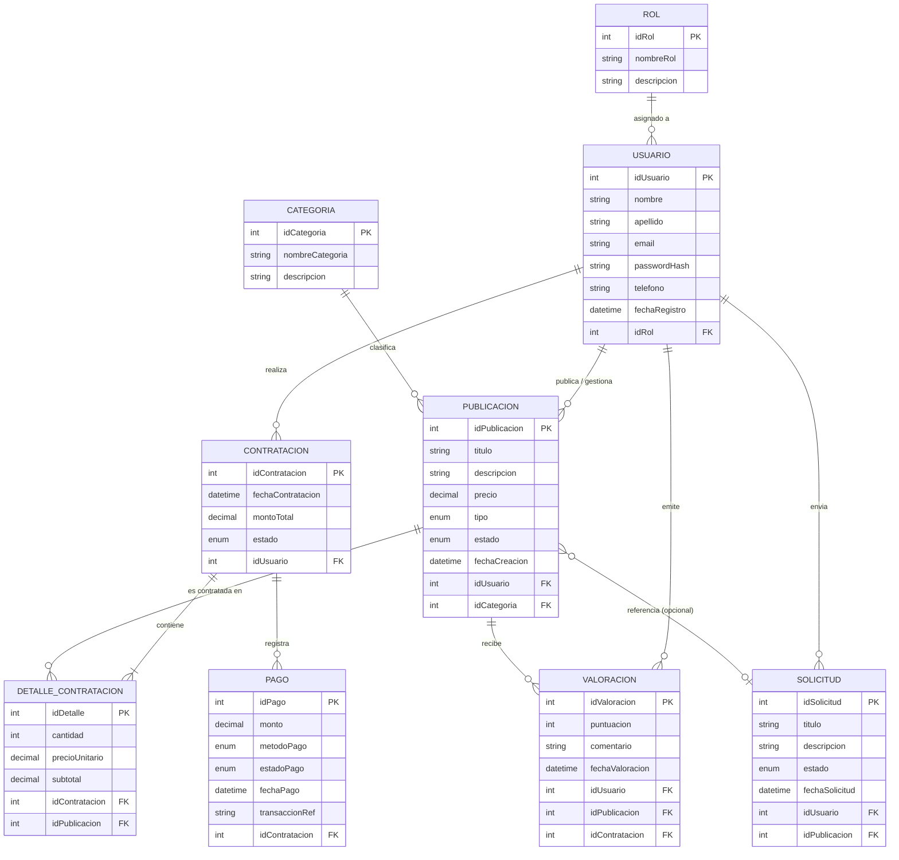

# Modelo Entidad-Relación (MER) Inicial - Classia

## Resumen del Modelo
Este documento especifica el **Modelo Entidad-Relación (MER)** inicial para la plataforma **Classia**, diseñado de forma clara, directa y libre de ambigüedades. Permite derivar sin inconvenientes el modelo relacional físico para la base de datos en MariaDB/MySQL/PostgreSQL.

---

## Diagrama Entidad-Relación (Mermaid ERD)

---

## Diccionario de Entidades y Atributos

### 1. Entidad: ROL
Representa los perfiles o tipos de usuarios permitidos en la plataforma.
* **`idRol`** (INT, PK, Auto-increment) - Obligatorio. Identificador único del rol.
* **`nombreRol`** (VARCHAR(50)) - Obligatorio. Nombre distintivo (ej. 'Cliente/Estudiante', 'Docente/Proveedor', 'Admin').
* **`descripcion`** (VARCHAR(255)) - Opcional. Explicación breve de los permisos del rol.

### 2. Entidad: USUARIO
Almacena las cuentas de usuario de la plataforma.
* **`idUsuario`** (INT, PK, Auto-increment) - Obligatorio. Identificador único.
* **`nombre`** (VARCHAR(100)) - Obligatorio. Nombre de la persona o entidad.
* **`apellido`** (VARCHAR(100)) - Obligatorio. Apellido del usuario.
* **`email`** (VARCHAR(150), UNIQUE) - Obligatorio. Correo electrónico único para inicio de sesión.
* **`passwordHash`** (VARCHAR(255)) - Obligatorio. Hash de la contraseña.
* **`telefono`** (VARCHAR(30)) - Opcional. Teléfono de contacto.
* **`fechaRegistro`** (DATETIME) - Obligatorio. Fecha/hora de creación del usuario.
* **`idRol`** (INT, FK -> `ROL.idRol`) - Obligatorio. Rol asociado.

### 3. Entidad: CATEGORIA
Agrupa y clasifica los distintos cursos y servicios ofrecidos.
* **`idCategoria`** (INT, PK, Auto-increment) - Obligatorio.
* **`nombreCategoria`** (VARCHAR(100)) - Obligatorio. Ej: 'Programación', 'Robótica', 'Diseño 3D', 'Mentorías'.
* **`descripcion`** (TEXT) - Opcional. Detalles de la categoría.

### 4. Entidad: PUBLICACION
Representa un curso o servicio ofertado en Classia por un docente/proveedor.
* **`idPublicacion`** (INT, PK, Auto-increment) - Obligatorio.
* **`titulo`** (VARCHAR(200)) - Obligatorio. Título de la oferta.
* **`descripcion`** (TEXT) - Obligatorio. Información detallada del curso/servicio.
* **`precio`** (DECIMAL(10,2)) - Obligatorio. Costo base de la publicación.
* **`tipo`** (ENUM('Curso', 'Servicio')) - Obligatorio. Define la naturaleza de la oferta.
* **`estado`** (ENUM('Activo', 'Inactivo', 'Pausado')) - Obligatorio. Estado de disponibilidad.
* **`fechaCreacion`** (DATETIME) - Obligatorio.
* **`idUsuario`** (INT, FK -> `USUARIO.idUsuario`) - Obligatorio. Proveedor/Docente autor de la publicación.
* **`idCategoria`** (INT, FK -> `CATEGORIA.idCategoria`) - Obligatorio. Categoría técnica a la que pertenece.

### 5. Entidad: SOLICITUD
Permite a los estudiantes solicitar presupuestos, información o adaptaciones personalizadas de un servicio/curso.
* **`idSolicitud`** (INT, PK, Auto-increment) - Obligatorio.
* **`titulo`** (VARCHAR(200)) - Obligatorio. Asunto o título de la solicitud.
* **`descripcion`** (TEXT) - Obligatorio. Requerimiento particular del estudiante.
* **`estado`** (ENUM('Pendiente', 'Aceptada', 'Rechazada', 'Cancelada')) - Obligatorio.
* **`fechaSolicitud`** (DATETIME) - Obligatorio.
* **`idUsuario`** (INT, FK -> `USUARIO.idUsuario`) - Obligatorio. Estudiante/Cliente que realiza la solicitud.
* **`idPublicacion`** (INT, FK -> `PUBLICACION.idPublicacion`) - Opcional. Publicación a la que aplica la solicitud (Nulo si es consulta general).

### 6. Entidad: CONTRATACION
Registra la transacción u orden de compra general de uno o varios servicios/cursos por parte de un estudiante.
* **`idContratacion`** (INT, PK, Auto-increment) - Obligatorio.
* **`fechaContratacion`** (DATETIME) - Obligatorio. Fecha del pedido o contratación.
* **`montoTotal`** (DECIMAL(10,2)) - Obligatorio. Suma total de los ítems contratados.
* **`estado`** (ENUM('Pendiente', 'En Proceso', 'Completada', 'Cancelada')) - Obligatorio.
* **`idUsuario`** (INT, FK -> `USUARIO.idUsuario`) - Obligatorio. Estudiante/Cliente comprador.

### 7. Entidad: DETALLE_CONTRATACION
Desglosa cada ítem (publicación) contratado dentro de una orden global.
* **`idDetalle`** (INT, PK, Auto-increment) - Obligatorio.
* **`cantidad`** (INT) - Obligatorio. Cantidad o cupos (por defecto 1).
* **`precioUnitario`** (DECIMAL(10,2)) - Obligatorio. Precio al momento de la contratación.
* **`subtotal`** (DECIMAL(10,2)) - Obligatorio. `cantidad * precioUnitario`.
* **`idContratacion`** (INT, FK -> `CONTRATACION.idContratacion`) - Obligatorio.
* **`idPublicacion`** (INT, FK -> `PUBLICACION.idPublicacion`) - Obligatorio.

### 8. Entidad: PAGO
Registra los desembolsos y cobros asociados a una contratación.
* **`idPago`** (INT, PK, Auto-increment) - Obligatorio.
* **`monto`** (DECIMAL(10,2)) - Obligatorio. Monto abonado.
* **`metodoPago`** (ENUM('Tarjeta', 'Transferencia', 'MercadoPago', 'Efectivo')) - Obligatorio.
* **`estadoPago`** (ENUM('Pendiente', 'Aprobado', 'Rechazado')) - Obligatorio.
* **`fechaPago`** (DATETIME) - Obligatorio.
* **`transaccionRef`** (VARCHAR(100)) - Opcional. Código de comprobante / gateway.
* **`idContratacion`** (INT, FK -> `CONTRATACION.idContratacion`) - Obligatorio.

### 9. Entidad: VALORACION
Almacena las reseñas y puntuaciones que realizan los usuarios sobre los cursos/servicios finalizados.
* **`idValoracion`** (INT, PK, Auto-increment) - Obligatorio.
* **`puntuacion`** (INT) - Obligatorio. Valor numérico (ej. 1 a 5).
* **`comentario`** (TEXT) - Opcional. Opinión escrita.
* **`fechaValoracion`** (DATETIME) - Obligatorio.
* **`idUsuario`** (INT, FK -> `USUARIO.idUsuario`) - Obligatorio. Usuario que emite la valoración.
* **`idPublicacion`** (INT, FK -> `PUBLICACION.idPublicacion`) - Obligatorio. Publicación evaluada.
* **`idContratacion`** (INT, FK -> `CONTRATACION.idContratacion`) - Opcional. Vincula con la transacción verificada.

---

## Relaciones y Cardinalidades

| Entidad Origen | Cardinalidad | Entidad Destino | Descripción de la Relación |
| :--- | :---: | :--- | :--- |
| **ROL** | `1 : N` | **USUARIO** | Un rol puede ser asignado a muchos usuarios. Todo usuario tiene obligatoriamente 1 rol. |
| **USUARIO** | `1 : N` | **PUBLICACION** | Un docente/proveedor publica N ofertas. Toda publicación tiene 1 único usuario creador. |
| **CATEGORIA** | `1 : N` | **PUBLICACION** | Una categoría engloba N publicaciones. Toda publicación pertenece a 1 categoría. |
| **USUARIO** | `1 : N` | **CONTRATACION** | Un estudiante realiza N contrataciones. Toda contratación pertenece a 1 usuario. |
| **CONTRATACION** | `1 : N` | **DETALLE_CONTRATACION** | Una contratación contiene al menos 1 detalle. Cada detalle pertenece a 1 única contratación. |
| **PUBLICACION** | `1 : N` | **DETALLE_CONTRATACION** | Una publicación puede contratarse en N detalles. Cada detalle refiere a 1 publicación. |
| **CONTRATACION** | `1 : N` | **PAGO** | Una contratación puede tener 1 o más intentos/registros de pago. Cada pago pertenece a 1 contratación. |
| **USUARIO** | `1 : N` | **VALORACION** | Un usuario puede emitir N valoraciones. Toda valoración pertenece a 1 autor. |
| **PUBLICACION** | `1 : N` | **VALORACION** | Una publicación recibe N valoraciones. Cada valoración aplica a 1 publicación. |
| **USUARIO** | `1 : N` | **SOLICITUD** | Un usuario envía N solicitudes. Toda solicitud la realiza 1 usuario. |
| **PUBLICACION** | `0..1 : N` | **SOLICITUD** | Una solicitud puede referenciar opcionalmente a 1 publicación específica. |

---

## Cumplimiento de Criterios de Aceptación
1. **Entidades representadas:** Incluye las 9 entidades solicitadas (`Usuario`, `Rol`, `Publicación`, `Categoría`, `Contratación`, `Detalle de contratación`, `Pago`, `Valoración`, `Solicitud`).
2. **Cardinalidades definidas:** Todas las asociaciones cuentan con cardinalidades mínimas y máximas unívocas.
3. **Ausencia de ambigüedad:** Se separa explícitamente la cabecera de la contratación (`CONTRATACION`) de su desglose (`DETALLE_CONTRATACION`), permitiendo carritos de compra e historial claro.
4. **Derivación relacional directa:** Cada FK surge de la regla de migración de claves de relaciones `1:N`.
