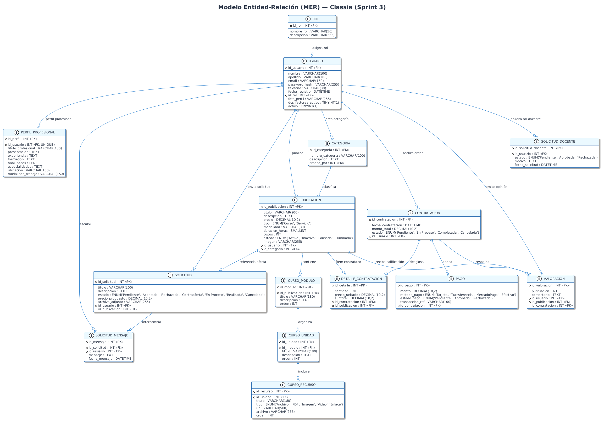
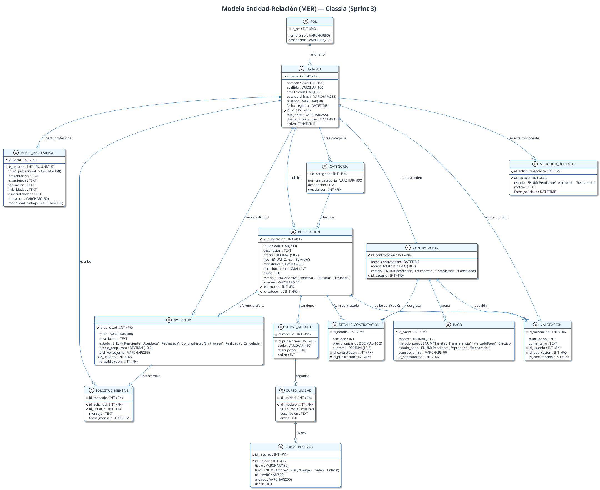

# Modelo Entidad-Relación (MER) — Classia · Segunda Entrega (Sprint 3)

## Resumen del Modelo
Este documento especifica el **Modelo Entidad-Relación (MER) actualizado** para la plataforma **Classia**, reflejando el estado real del sistema al cierre del **Sprint 3 (Segunda Entrega Funcional y Técnica)**. La nomenclatura de atributos coincide exactamente con el esquema físico definido en [`sql/schema.sql`](../sql/schema.sql) (convención `snake_case` de MariaDB/MySQL).

> **Última actualización:** Segunda entrega funcional y técnica (Sprint 3)  
> **Coherencia validada contra:** `sql/schema.sql`

---

## Diagrama Entidad-Relación (PlantUML / draw.io)

*Versión vectorial:* [mer_classia.svg](diagramas/mer_classia.svg) | *Código fuente:* [mer_classia.puml](diagramas/mer_classia.puml)

### Código Fuente PlantUML

---

## Diccionario de Entidades y Atributos

### 1. Entidad: ROL
Representa los perfiles de usuario permitidos en la plataforma (`roles`).
- `id_rol` (INT, PK, AUTO_INCREMENT)
- `nombre_rol` (VARCHAR(50), NOT NULL UNIQUE)
- `descripcion` (VARCHAR(255), NULL)

### 2. Entidad: USUARIO
Almacena las cuentas de usuario de la plataforma (`usuarios`).
- `id_usuario` (INT, PK, AUTO_INCREMENT)
- `nombre`, `apellido` (VARCHAR(100), NOT NULL)
- `email` (VARCHAR(150), NOT NULL UNIQUE)
- `password_hash` (VARCHAR(255), NOT NULL)
- `telefono` (VARCHAR(30), NULL)
- `id_rol` (INT, FK -> roles)
- `dos_factores_activo` (TINYINT(1), NOT NULL DEFAULT 0)
- `activo` (TINYINT(1), NOT NULL DEFAULT 1)

### 3. Entidad: PERFIL_PROFESIONAL
Perfil extendido para docentes y prestadores (`perfiles_profesionales`).
- `id_perfil` (INT, PK, AUTO_INCREMENT)
- `id_usuario` (INT, FK UNIQUE -> usuarios)
- `titulo_profesional` (VARCHAR(180))
- `presentacion`, `experiencia`, `formacion`, `certificaciones`, `habilidades`, `especialidades` (TEXT)
- `ubicacion`, `modalidad_trabajo` (VARCHAR(150))
- `portfolio_url`, `linkedin_url` (VARCHAR(255))

### 4. Entidad: CATEGORIA
Agrupa las áreas de cursos y servicios (`categorias`).
- `id_categoria` (INT, PK, AUTO_INCREMENT)
- `nombre_categoria` (VARCHAR(100), NOT NULL UNIQUE)
- `descripcion` (TEXT, NULL)
- `creada_por` (INT, FK -> usuarios)

### 5. Entidad: PUBLICACION
Oferta formativa o servicio a medida (`publicaciones`).
- `id_publicacion` (INT, PK, AUTO_INCREMENT)
- `titulo` (VARCHAR(200), NOT NULL)
- `descripcion` (TEXT, NOT NULL)
- `precio` (DECIMAL(10,2), NOT NULL)
- `tipo` (ENUM('Curso','Servicio'), NOT NULL)
- `modalidad` (VARCHAR(30))
- `duracion_horas` (SMALLINT)
- `cupos` (INT)
- `estado` (ENUM('Activo','Inactivo','Pausado','Eliminado'), NOT NULL DEFAULT 'Activo')
- `imagen` (VARCHAR(255))
- `id_usuario` (INT, FK -> usuarios)
- `id_categoria` (INT, FK -> categorias)

### 6. Entidades de Estructura de Curso: CURSO_MODULO, CURSO_UNIDAD, CURSO_RECURSO
Organización modular de lecciones y recursos con soporte Supabase Cloud (`curso_modulos`, `curso_unidades`, `curso_recursos`).

### 7. Entidades de Servicios y Negociación: SOLICITUD, SOLICITUD_MENSAJE, SOLICITUD_DOCENTE
Flujo interactivo de presupuestos y postulación docente (`solicitudes`, `solicitud_mensajes`, `solicitudes_docente`).

### 8. Entidades Comerciales: CONTRATACION, DETALLE_CONTRATACION, PAGO, VALORACION
Gestión de compras, pasarela de pago y opiniones con puntuación 1-5 (`contrataciones`, `detalles_contratacion`, `pagos`, `valoraciones`).
