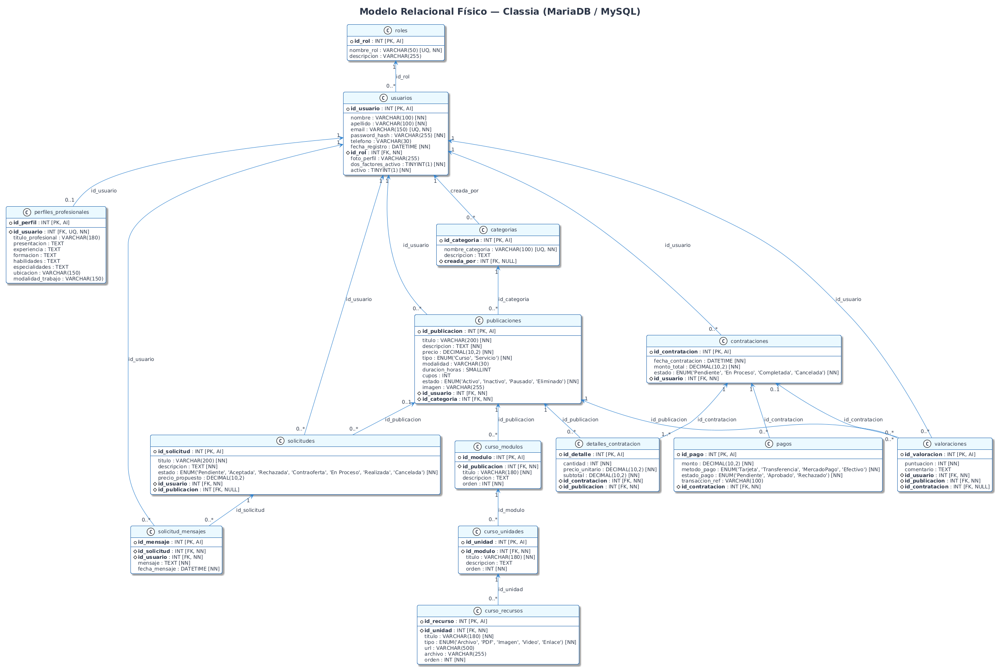
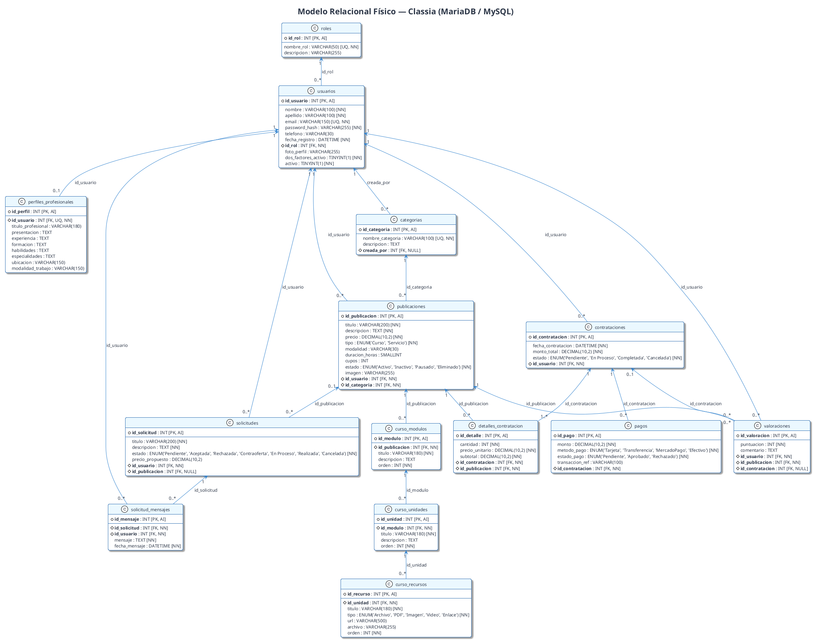

# Modelo Relacional — Classia · Segunda Entrega (Sprint 3)

## Especificación del Esquema Físico
Este documento detalla el **Modelo Relacional Lógico y Físico** correspondiente a la base de datos MariaDB / MySQL de la plataforma **Classia**.

> **Última actualización:** Segunda Entrega (Sprint 3)  
> **Script físico asociado:** [`sql/schema.sql`](../sql/schema.sql)

---

## Diagrama del Modelo Relacional (PlantUML / draw.io)

*Versión vectorial:* [modelo_relacional_classia.svg](diagramas/modelo_relacional_classia.svg) | *Código fuente:* [modelo_relacional_classia.puml](diagramas/modelo_relacional_classia.puml)

### Código Fuente PlantUML

---

## Tablas y Claves Foráneas

1. `roles` (**id_rol** [PK])
2. `usuarios` (**id_usuario** [PK], `id_rol` [FK -> roles])
3. `perfiles_profesionales` (**id_perfil** [PK], `id_usuario` [FK UNIQUE -> usuarios])
4. `categorias` (**id_categoria** [PK], `creada_por` [FK -> usuarios])
5. `publicaciones` (**id_publicacion** [PK], `id_usuario` [FK -> usuarios], `id_categoria` [FK -> categorias])
6. `curso_modulos` (**id_modulo** [PK], `id_publicacion` [FK -> publicaciones])
7. `curso_unidades` (**id_unidad** [PK], `id_modulo` [FK -> curso_modulos])
8. `curso_recursos` (**id_recurso** [PK], `id_unidad` [FK -> curso_unidades])
9. `solicitudes` (**id_solicitud** [PK], `id_usuario` [FK -> usuarios], `id_publicacion` [FK -> publicaciones])
10. `solicitud_mensajes` (**id_mensaje** [PK], `id_solicitud` [FK -> solicitudes], `id_usuario` [FK -> usuarios])
11. `solicitudes_docente` (**id_solicitud_docente** [PK], `id_usuario` [FK -> usuarios])
12. `contrataciones` (**id_contratacion** [PK], `id_usuario` [FK -> usuarios])
13. `detalles_contratacion` (**id_detalle** [PK], `id_contratacion` [FK -> contrataciones], `id_publicacion` [FK -> publicaciones])
14. `pagos` (**id_pago** [PK], `id_contratacion` [FK -> contrataciones])
15. `valoraciones` (**id_valoracion** [PK], `id_usuario` [FK -> usuarios], `id_publicacion` [FK -> publicaciones], `id_contratacion` [FK -> contrataciones])
